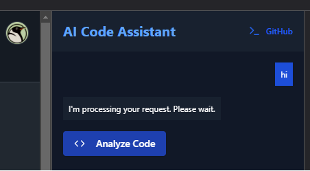

# AI-code-analysis-browser-extension

Una extensión de Chrome que utiliza IA para analizar código y proporcionar recomendaciones inteligentes en tiempo real.



## 🌟 Características

- 🔍 Análisis automático de código en archivos
- 💡 Recomendaciones inteligentes basadas en IA
- 🚀 Soporte inicial para GitHub
- 📊 Panel de visualización de recomendaciones
- ⚡ Análisis en tiempo real

## 🛠️ Tecnologías

- Chrome Extensions API
- JavaScript
- AI/ML para análisis de código
- HTML/CSS para la interfaz

## 📦 Instalación

1. Clona este repositorio:

```bash
git clone https://github.com/diekotto/AI-code-analysis-browser-extension.git
```

2. Abre Chrome y navega a `chrome://extensions/`

3. Activa el "Modo desarrollador" en la esquina superior derecha

4. Haz clic en "Cargar descomprimida" y selecciona la carpeta del proyecto

## 🔧 Configuración

1. Crea un archivo `.env` en la raíz del proyecto:

```
API_ENDPOINT=tu-endpoint-de-api
API_KEY=tu-api-key
```

2. Configura tu endpoint de API en `content.js`:

```javascript
const API_ENDPOINT = "https://tu-api-endpoint.com/analyze";
```

## 🚀 Uso

1. Navega a cualquier archivo de código en GitHub
2. Haz clic en el icono de la extensión
3. Espera a que el análisis se complete
4. Revisa las recomendaciones en el panel lateral

## 🤝 Contribuir

Las contribuciones son bienvenidas! Por favor, sigue estos pasos:

1. Fork el proyecto
2. Crea una rama para tu feature (`git checkout -b feature/AmazingFeature`)
3. Commit tus cambios (`git commit -m 'Add some AmazingFeature'`)
4. Push a la rama (`git push origin feature/AmazingFeature`)
5. Abre un Pull Request

## 📝 TODO

- [ ] Añadir soporte para más sitios de código (GitLab, Bitbucket)
- [ ] Implementar caché de análisis
- [ ] Mejorar la UI/UX del panel de recomendaciones
- [ ] Añadir más tipos de análisis
- [ ] Implementar test unitarios
- [ ] Añadir configuraciones personalizables

## 🔑 Licencia

Este proyecto está bajo la licencia MIT - ver el archivo [LICENSE.md](LICENSE.md) para más detalles.

## 👥 Autores

- Diego Maroto - [GitHub](https://github.com/diekotto)

## 🙏 Agradecimientos

- OpenAI/Anthropic por su API de IA
- La comunidad de desarrolladores de extensiones de Chrome
- Todos los contribuidores

## 📧 Contacto

Diego Maroto - [@diekotto](https://x.com/diekotto)

Link del proyecto: [https://github.com/diekotto/AI-code-analysis-browser-extension.git](https://github.com/diekotto/AI-code-analysis-browser-extension.git)
